# Utilisation des filtres de kibana-prod sur item pour travailler sur les logs

## Guide pour voir les logs d'item de traitement des demandes en production pour comprendre en cas d'incident ou de bug pourquoi ça n'a pas fonctionné

- se connecter sur https://kibana-prod.abes.fr/ avec vos identifiants

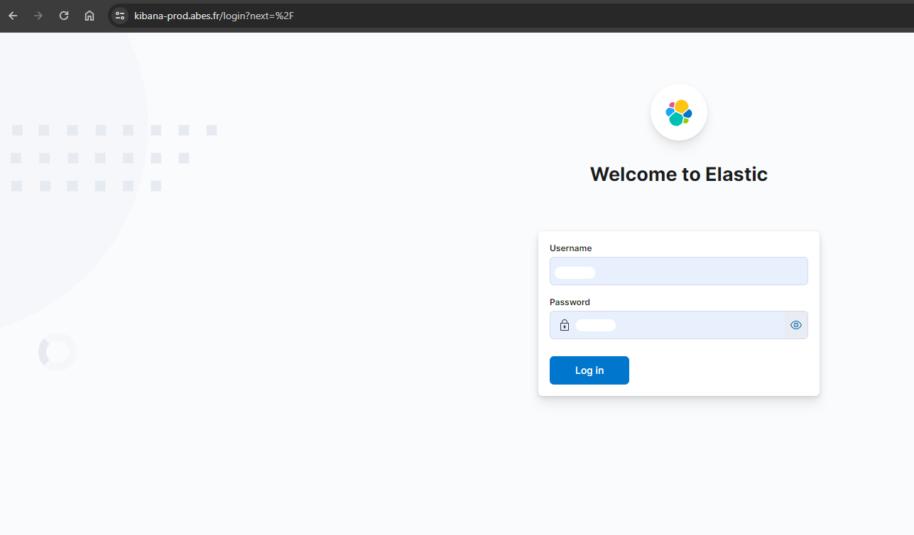

- selectionner son espace qui a été préalablement crée par le SIRE (aller voir le SIRE pour créer son espace)

- dans son espace, cliquer sur les elements suivants pour permettre d'avoir une visualisation des logs qui suivent un élément qu'on recherche dans le champ message
- dans **message** : on retrouve les logs qui sont dans item-batch

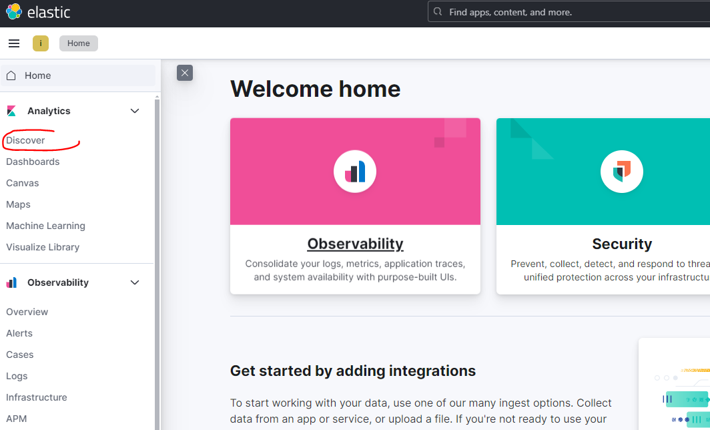

- prendre item-batch

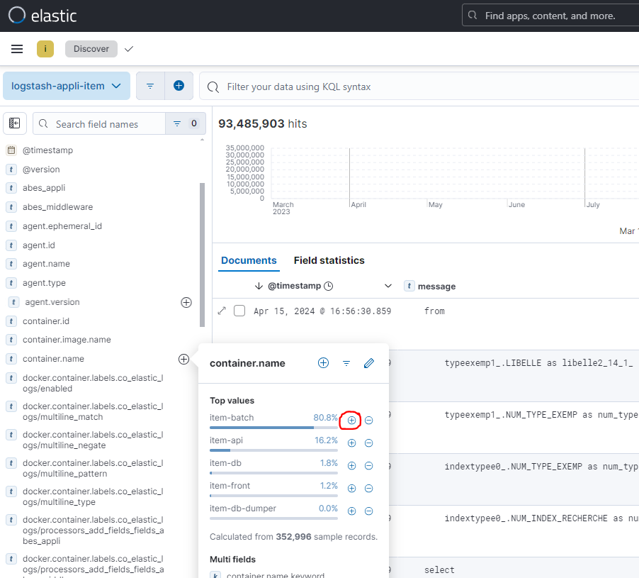

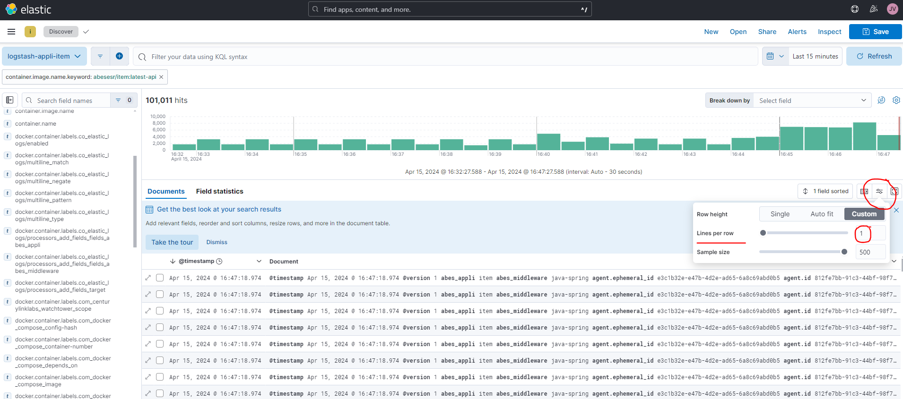

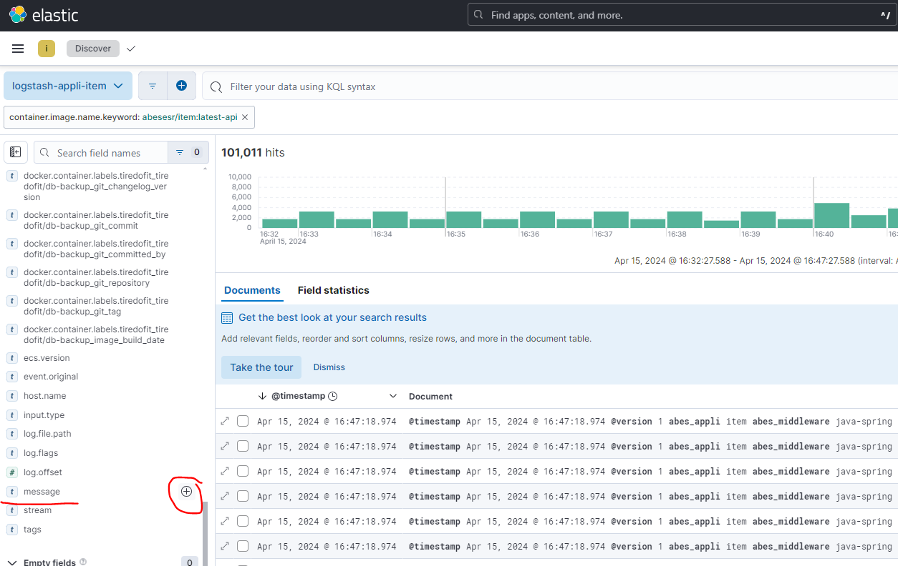

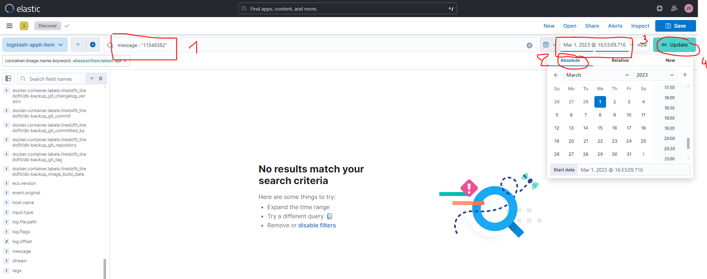

- le + à coté du timestamp va permettre de partir de l'heure d'origine du premier message recherché qui correspond au match effectué dans le champ de la recherche

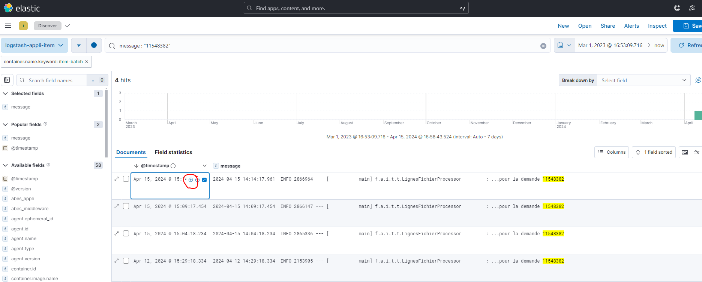

- sort old new pour les avoir dans l'ordre chronologique

- editer le filtre pour créer une plage de temps de recherche

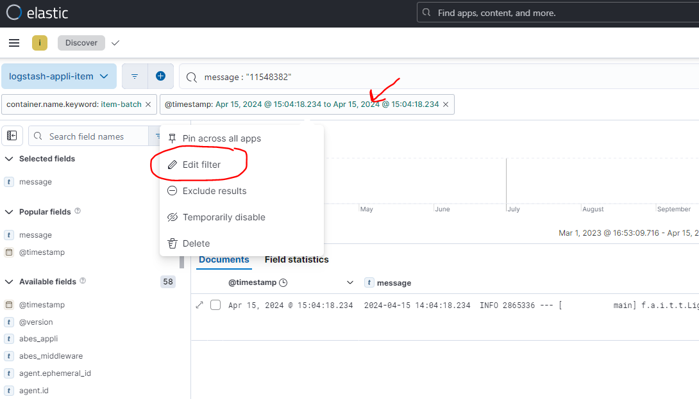

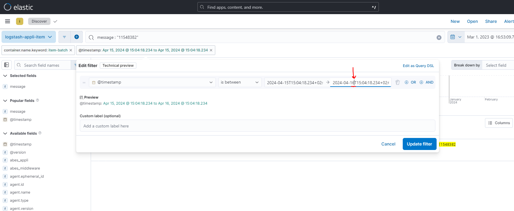

- supprimer le filtre de recherche et refresh

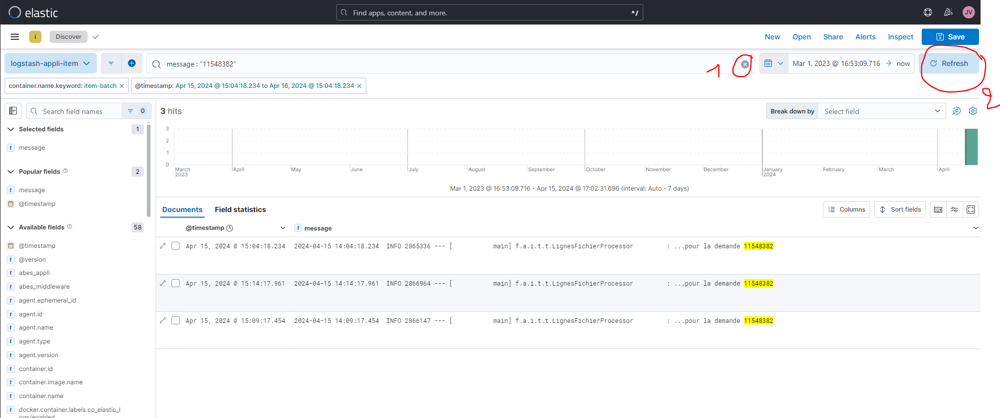

- replacer le filtre du timestamp en chronologique

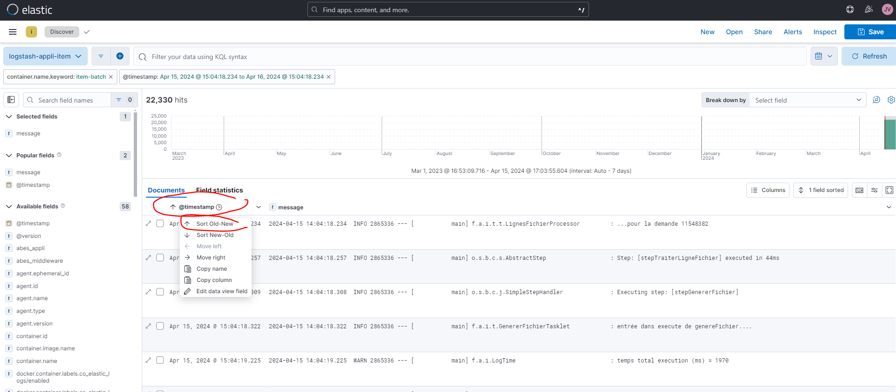

- on peut maintenant avoir toutes les lignes qui suivent la recherche par filtre effectuée (soit toutes les lignes qui suivent le traitement d'une demande)

## Pour retrouver les lignes traitées par le batch sur une demande spécifique comprise dans un plage (exemple le filtre dbeaver sur la demande 11548382)

- faire ensuite un filtre dans kibana avec en paramètre le num_lignefichier pour retrouver ce qui s'est passé