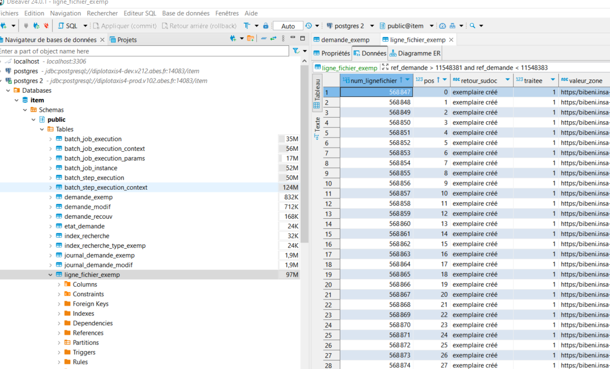

# Travailler avec le module batch en local

**Il faut préciser impérativement le job que l'on veut lancer. 
Les noms des jobs sont disponibles dans la classe JobConfiguration (Méthodes annotées @Bean retournant un job)**

Exemple pour le job nommé traiterLigneFichierModif

```java
new JobBuilder("traiterLigneFichierModif",
```

## Comment lancer en local mon job ?

- Méthode 1 : avec intellij Créer une nouvelle configuration de lancement comme suit :

- Aller dans Modify options > Override configuration properties > puis cliquer sur le +
- ajouter dans name > spring.batch.job.name
- ajouter dans value > [NOM_DU_JOB_A_LANCER]

---

- Méthode 2 compatible tout IDE
- Aller dans le fichier de propriétés application-localhost.properties
- rajouter par exemple pour le job **traiterLigneFichierModif**
- ```spring.batch.job.name=traiterLigneFichierModif```
- Bien veiller à être dans le bon fichier de propriété du bon module (erreur courante de modifier le application.properties de web et non de batch)
- Relancer le programme le job doit etre pris en compte

**Toujours se référer à JobConfiguration pour connaitre le nom des jobs existants**

## Jobs

Jobs
Les jobs représentent un processus métier complet et sont composés d'une ou plusieurs steps. Ils sont définis dans la classe JobConfiguration en utilisant le JobBuilder. Chaque job a un nom unique et est associé à un JobRepository pour stocker les métadonnées d'exécution.

Exemples de jobs :
jobTraiterLigneFichier : job de lancement d'un traitement de modification

## Steps

Les steps sont des étapes distinctes d'un job et peuvent être de deux types : tasklet ou chunk. Elles sont définies en utilisant le StepBuilder et sont associées à un job.
Exemples de steps :

stepRecupererNextDemandeModif : récupère la prochaine demande de modification

## Tasklets

Les tasklets sont des tâches autonomes exécutées dans une step. Elles implémentent l'interface Tasklet et contiennent la logique métier spécifique. Elles sont définies en tant que beans dans la classe JobConfiguration.
Exemples de tasklets :

getNextDemandeModifTasklet : récupère la prochaine demande de modification

